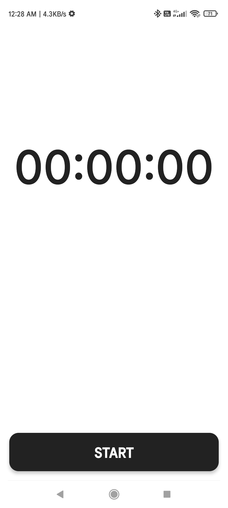
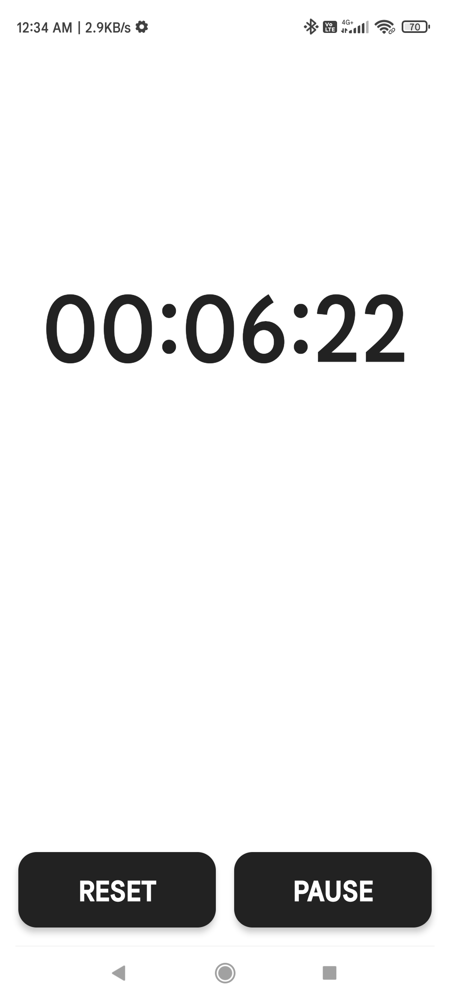
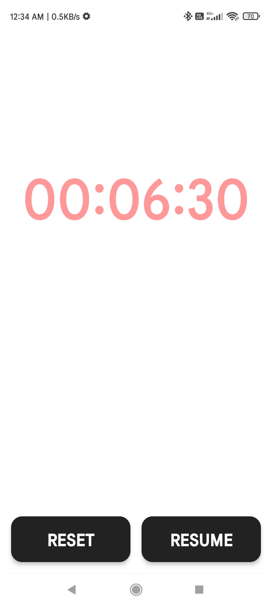
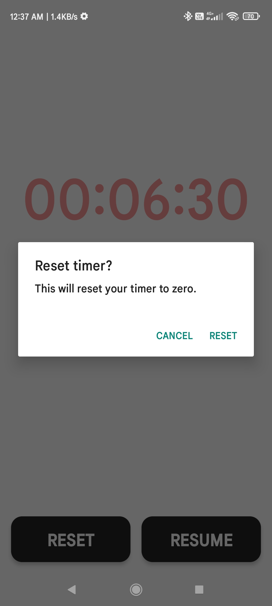

# Work Timer

A simple React Native app that I built in my free time to help me track hours worked.
This app does almost exactly what the timer in the Android Clock app does with one
small difference. When you try to reset the timer on the Clock app, the app does not
ask for confirmation. I really needed that feature because I wanted to avoid accidentally
resetting the timer and losing track of hours I've worked for the day.

The app in its current state does not save day-wise records of the hours worked. Maybe
that's something I'd add in the future.

## Setup

Before you get started, make sure you've set up the [React Native development environment](https://reactnative.dev/docs/environment-setup).

Clone this repository and then run `npm install` at the root directory. Then run the app using `npm run android`.

# Screenshots

# License

    Copyright 2022 David Heisnam

    Licensed under the Apache License, Version 2.0 (the "License");
    you may not use this file except in compliance with the License.
    You may obtain a copy of the License at
    
        http://www.apache.org/licenses/LICENSE-2.0
    
    Unless required by applicable law or agreed to in writing, software
    distributed under the License is distributed on an "AS IS" BASIS,
    WITHOUT WARRANTIES OR CONDITIONS OF ANY KIND, either express or implied.
    See the License for the specific language governing permissions and
    limitations under the License.
